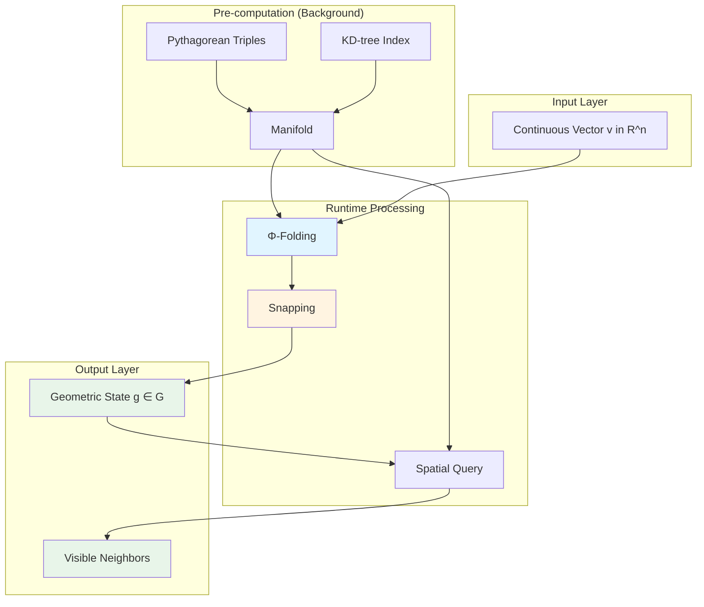
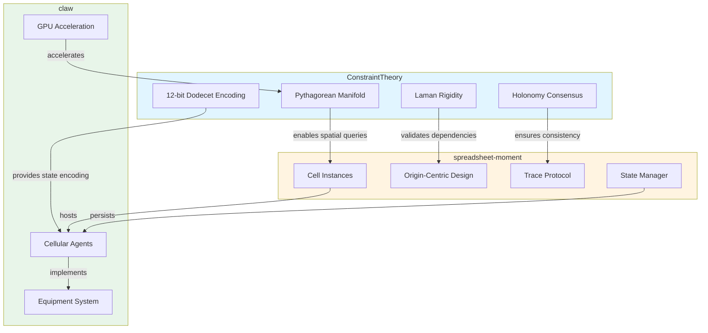
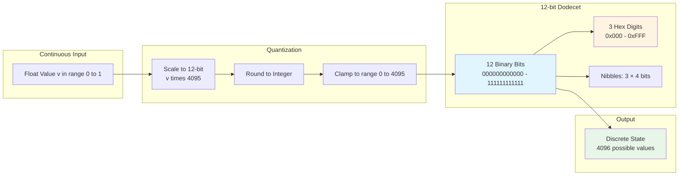
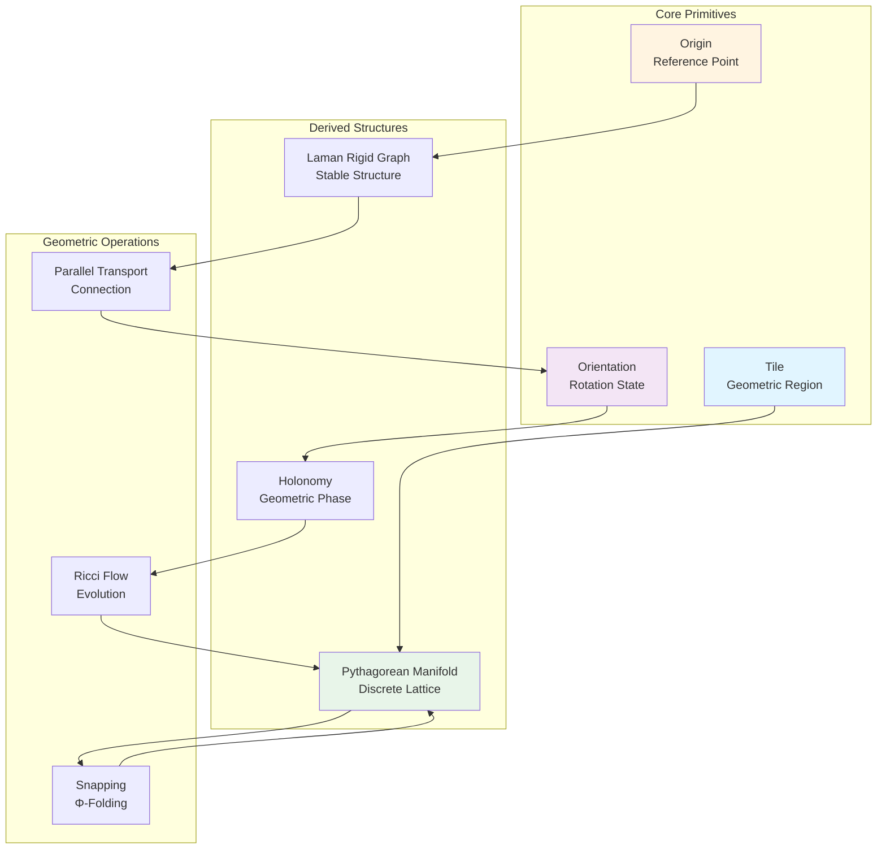
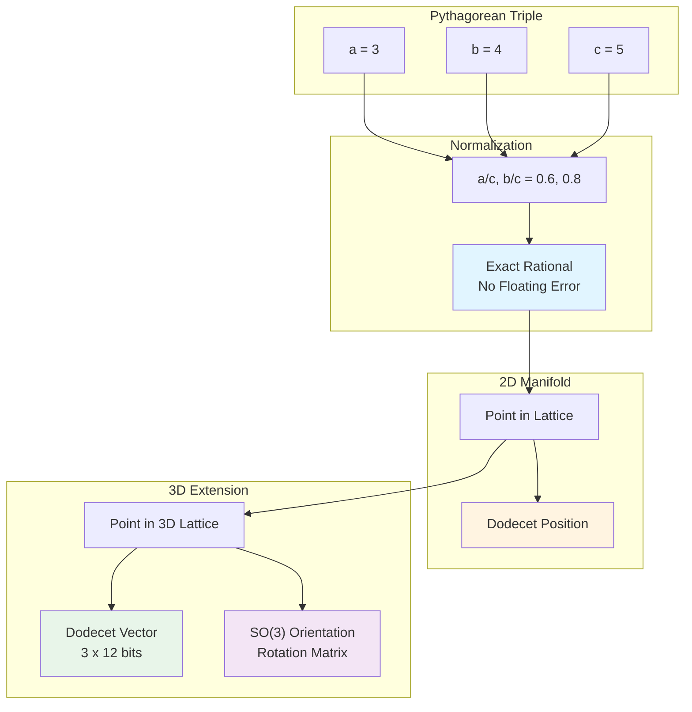
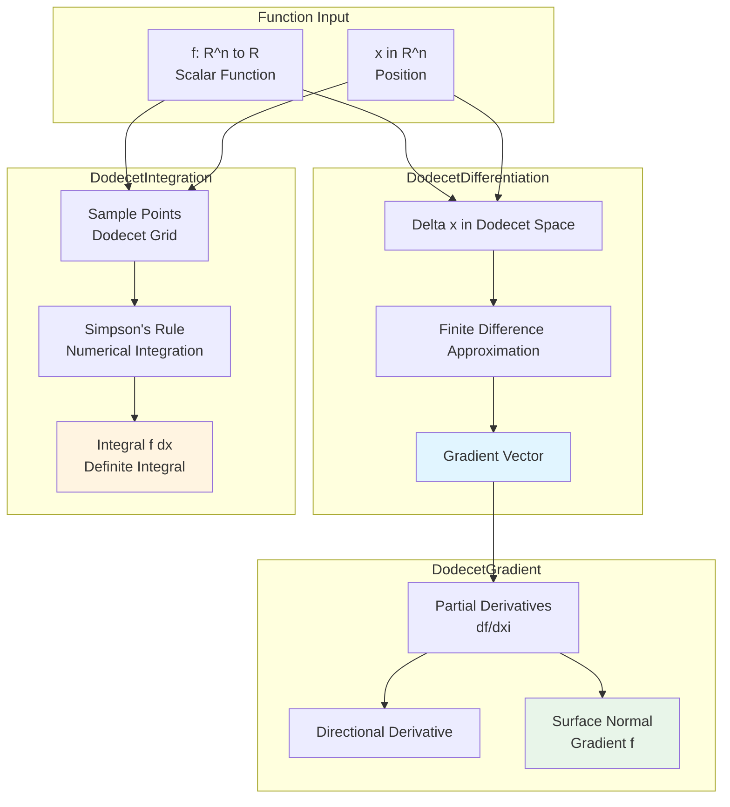
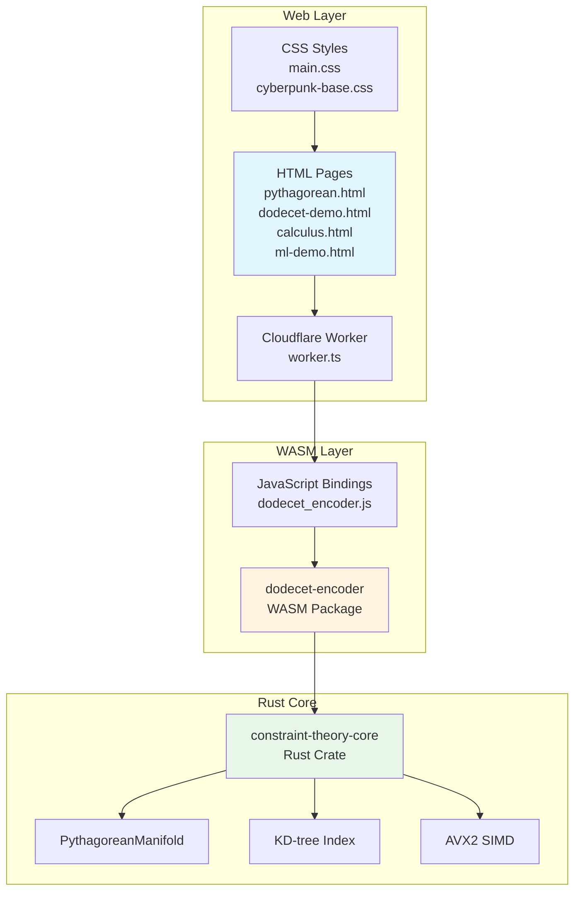
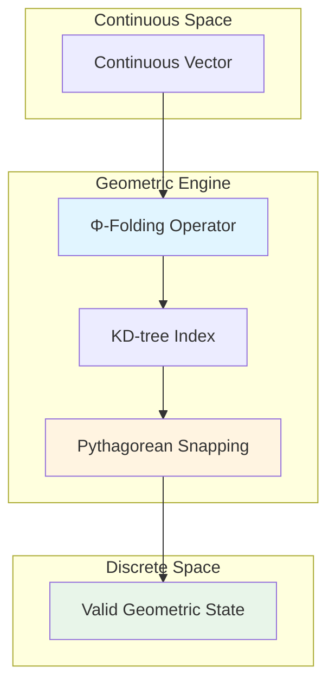

# Constraint Theory

**Geometric substrate for cellularized agent infrastructure**

[](https://opensource.org/licenses/MIT)
[](docs/)
[](https://crates.io/crates/constraint-theory-core)

**Live Demo:** https://constraint-theory.superinstance.ai

---

## The Problem: Traditional AI is RTS-Style

Traditional systems use a bird's-eye view where all agents see the same data:

```
┌─────────────────────────────────────┐
│     RTS (Real-Time Strategy)        │
│                                     │
│   Central Controller sees ALL       │
│   ↙  ↘       ↙  ↘       ↙  ↘       │
│  A1   A2     A3   A4     A5   A6   │
│  ↓    ↓      ↓    ↓      ↓    ↓     │
│ All agents share global state       │
│                                     │
│  Problem: Doesn't scale             │
│  - Central bottleneck               │
│  - Shared state coordination        │
│  - O(n²) communication complexity   │
└─────────────────────────────────────┘
```

Every agent needs to coordinate with every other agent. As agent count grows, coordination cost explodes.

---

## Our Solution: FPS-Style Perspective

Constraint Theory gives each agent its own first-person-shooter perspective:

```
┌────────────────────────────────────────────────────────────┐
│            FPS (First-Person-Shooter)                     │
│                                                            │
│  Agent A1 (position: dodecet_0x123, orientation: φ=0.73)  │
│      │                                                     │
│      │ Sees neighbors within geometric radius             │
│      ▼                                                     │
│  ┌─────────────────┐                                       │
│  │ Agent A1's View  │                                       │
│  │                 │                                       │
│  │  [A2]──[A3]     │  <- Only visible agents              │
│  │    │    │       │                                       │
│  │  [A1]──[A4]     │  <- A1 is center                     │
│  │                 │                                       │
│  └─────────────────┘                                       │
│                                                            │
│  Agent A5 (position: dodecet_0x456, orientation: φ=1.24)  │
│      │                                                     │
│      │ Different perspective, different visible set       │
│      ▼                                                     │
│  ┌─────────────────┘                                       │
│  │ Agent A5's View  │                                       │
│  │                 │                                       │
│  │  [A6]           │  <- Different neighbors               │
│  │    │            │                                       │
│  │  [A5]──[A7]     │                                       │
│  │                 │                                       │
│  └─────────────────┘                                       │
│                                                            │
│  Benefit: Scales naturally                                 │
│  - No central coordinator needed                          │
│  - Each agent independent                                 │
│  - O(log n) spatial queries via KD-tree                   │
└────────────────────────────────────────────────────────────┘
```

**Key innovation:** Each agent has a unique position and orientation in multidimensional space. This automatically filters and contextualizes information - no global coordination required.

---

## How It Works: Geometric Viewpoint Encoding

### System Architecture



### 1. Precalculate Geometry into Viewpoint Encoding

We transform continuous vectors into discrete geometric states:

```rust
use constraint_theory_core::{PythagoreanManifold, snap};

// Create manifold with exact Pythagorean triples
let manifold = PythagoreanManifold::new(200);

// Snap continuous vector to exact discrete state
let vec = [0.6f32, 0.8];
let (snapped, noise) = snap(&manifold, vec);

assert!(noise < 0.001);  // Guaranteed exact result
println!("Snapped: ({}, {})", snapped[0], snapped[1]);
// Output: (0.6, 0.8) = (3/5, 4/5) exactly
```

### 2. Agents Get Perspective-Based Feeds

Each agent's state is a point in the geometric manifold:

```mermaid
flowchart LR
    subgraph AgentState["Agent State (~112 bits)"]
        POS[position: Dodecet<br/>12 bits]
        ORIENT[orientation: phi<br/>32 bits]
        HOL["holonomy: SO(3)<br/>36 bits"]
        CONF[confidence<br/>32 bits]
    end

    subgraph Operations["Operations"]
        LOOKUP[O(1) State Lookup]
        QUERY[O(log n) Neighbor Query]
        UPDATE[O(1) State Update]
    end

    POS --> LOOKUP
    POS --> QUERY
    AgentState --> UPDATE

    style POS fill:#e1f5ff
    style ORIENT fill:#fff4e1
    style HOL fill:#f3e5f5
    style CONF fill:#e8f5e9
```

```rust
struct AgentState {
    // Position in 12-bit dodecet space
    position: Dodecet,  // 12 bits

    // Orientation (gauge field value)
    orientation: f32,    // 32 bits

    // Holonomy (accumulated geometric phase)
    holonomy: SO3Matrix, // 36 bits (compressed)

    // Confidence (distance from constraint surface)
    confidence: f32,     // 32 bits

    // Total: ~112 bits = 14 bytes per agent
}
```

### 3. Data Triggers Attention Based on Position

Agents query their neighborhood via O(log n) KD-tree lookup:

```rust
// Agent queries visible neighborhood
let visible_set = manifold.neighbors(agent.position, radius);

// Only see agents within geometric radius
// Automatic filtering - no global scan needed
```

### 4. Fast From the Ground Up

**Performance:**
- O(1) lookup via pre-evolved manifold
- O(log n) spatial queries via KD-tree
- ~100× faster than NumPy brute-force baseline
- Zero floating-point ambiguity (exact arithmetic)

---

## The Paradigm Shift

| Aspect | Traditional (RTS) | Constraint Theory (FPS) |
|--------|-------------------|-------------------------|
| **Perspective** | Global view | Local view |
| **State** | Shared global state | Independent geometric state |
| **Communication** | O(n²) all-to-all | O(log n) neighborhood queries |
| **Scaling** | Central bottleneck | Natural parallelism |
| **Guarantees** | Probabilistic | Deterministic (within model) |
| **Invalid Outputs** | Filtered post-hoc | Excluded by construction |

---

## Integration with Other Projects

Constraint Theory is part of a three-repo cellular agent ecosystem:



### How They Work Together

**spreadsheet-moment** provides:
- Cell instances where agents live
- Origin-centric data flow
- Trace protocol for provenance
- State management

**claw** provides:
- Cellular agent engine
- Equipment system (MEMORY, REASONING, etc.)
- GPU acceleration
- Minimal Rust implementation

**constrainttheory** provides:
- 12-bit dodecet encoding for agent state
- Geometric substrate for spatial queries
- Rigidity checking for dependency validation
- Holonomy consensus for distributed agreement

---

## Dodecet Encoding Flow

The 12-bit dodecet encoding transforms continuous coordinates into discrete geometric states:



**Key Properties:**
- 4096 discrete states (vs 256 for 8-bit)
- Hex-friendly: exactly 3 hex digits
- 16x compression vs 32-bit float for normalized [0,1] range

---

## Geometric Primitive Relationships



---

## Use Cases

### 1. Mass Multiagent Collaboration

**Problem:** Coordinating thousands of agents
**Solution:** Each agent operates independently with FPS perspective

```rust
// Spawn 10,000 agents
for i in 0..10_000 {
    let position = Dodecet::random();
    let agent = Agent::new(position, orientation);
    agents.push(agent);
}

// Each agent queries local neighborhood
for agent in &agents {
    let visible = manifold.neighbors(agent.position, radius);
    // Process only visible agents - O(log n) per agent
}
```

### 2. LLM Distillation into Geometric Determinants

**Vision:** Decompose monolithic LLM into swarm of geometric agents

```
Traditional LLM:
  Input → [175B parameter network] → Output
           (stochastic, black box)

Geometric Swarm:
  Input → [Agent_1] → [Agent_2] → ... → [Agent_n] → Consensus
          (deterministic, explainable)
```

**Process:**
1. Decompose LLM capabilities into geometric primitives
2. Assign each primitive to specialized agent
3. Coordinate via geometric substrate
4. Achieve consensus via holonomy verification

### 3. Agents with Asymmetric Understanding

**Problem:** Different agents need different views of same data
**Solution:** FPS perspective provides automatic filtering

```rust
// Agent at position A sees different data than agent at B
let view_A = manifold.neighbors(dodecet_0x123, radius);
let view_B = manifold.neighbors(dodecet_0x456, radius);

// Automatic asymmetric understanding - no manual filtering
```

**Use cases:**
- Fog-of-war scenarios
- Role-based access control
- Hierarchical decision making
- Privacy-preserving computation

### 4. Asynchronous Monitoring/Execution

**Problem:** Agents need to monitor and react to changes
**Solution:** Geometric proximity triggers automatic attention

```rust
// Background: manifold evolves via Ricci flow
loop {
    ricci_flow_step(&mut manifold);
    // Manifold self-organizes toward constraint satisfaction
}

// Foreground: agents query pre-evolved state
let current_state = manifold.lookup(agent.position);
// O(1) lookup - answer pre-computed by background evolution
```

---

## Mathematical Foundations

### Core Concepts

1. **Geometric State Space (G)**
   ```
   G = {g | C(g) = true}
   ```
   All valid states satisfy constraint C by construction.

2. **Φ-Folding Operator**
   ```
   Φ(v) = argmin_{g ∈ G} ||v - g||
   ```
   Maps continuous vectors to discrete valid states in O(log n).

3. **Deterministic Guarantee**
   ```
   P(hallucination | constraint_system) = 0
   ```
   Invalid outputs are mathematically impossible.

### Key Theorems

**Laman Rigidity ↔ Zero Ricci Curvature**
```
Rigid structure ⇔ κ_ij = 0
```
Rigid structures are geometric attractors - stable memory states.

**Holonomy-Information Equivalence**
```
H(γ) ↔ I_loss(γ)
```
Zero holonomy = Zero information loss = Perfect memory recall.

> **Important:** These guarantees apply ONLY within the geometric constraint engine, not to LLMs or AI systems generally. See [DISCLAIMERS.md](docs/DISCLAIMERS.md) for important clarifications.

---

## 3D Pythagorean Visualization

The Pythagorean manifold encodes exact rational coordinates:



**3D Coordinates:** Uses 3 dodecets (36 bits) for position + compressed SO(3) matrix (36 bits) for orientation.

---

## Calculus Operations Flow



---

## Simulator Structure



---

## Quick Start

### Installation

```bash
# Clone the repository
git clone https://github.com/SuperInstance/constraint-theory.git
cd constraint-theory

# Run tests
cargo test --release

# Try the visualizer
cd web-simulator
npm install
npm run dev
# Open http://localhost:8787
```

### Basic Usage

```rust
use constraint_theory_core::{PythagoreanManifold, snap};

// Create manifold with 200 Pythagorean triples
let manifold = PythagoreanManifold::new(200);

// Snap continuous vector to nearest valid state
let vec = [0.6f32, 0.8];
let (snapped, noise) = snap(&manifold, vec);

assert!(noise < 0.001);  // Exact result
println!("Snapped: ({}, {}) with noise {}", snapped[0], snapped[1], noise);
```

### Interactive Demo

Try the **Pythagorean Manifold Visualizer**:
**Live demo:** https://constraint-theory.superinstance.ai

### ML Demonstrations and Examples

Interactive ML demonstrations and real-world examples have been moved to a separate repository:

**[constrainttheory-ml-demo](https://github.com/SuperInstance/constrainttheory-ml-demo)**

This includes:
- Neural Network Visualization
- Gradient Descent Animation
- Feature Map Embeddings
- Template Gallery with 25+ starter examples
- Web simulators for all geometric operations
- Rust ML examples and benchmarks

---

## Architecture



**Flow:**
1. **Input:** Continuous vector in ℝⁿ
2. **Φ-Folding:** Map to nearest valid geometric region
3. **KD-tree:** O(log n) spatial lookup
4. **Snapping:** Quantize to Pythagorean triple
5. **Output:** Exact discrete state

---

## Project Structure

```
constrainttheory/
├── crates/
│   ├── constraint-theory-core/    # Core geometric engine (Rust)
│   │   ├── src/
│   │   │   ├── manifold.rs        # PythagoreanManifold + KD-tree
│   │   │   ├── kdtree.rs          # Spatial indexing
│   │   │   ├── simd.rs            # AVX2 vectorization
│   │   │   ├── curvature.rs       # Ricci flow evolution
│   │   │   ├── cohomology.rs      # Sheaf cohomology
│   │   │   ├── percolation.rs     # Rigidity percolation
│   │   │   └── gauge.rs           # Holonomy transport
│   │   └── Cargo.toml
│   └── gpu-simulation/            # GPU simulation framework
├── packages/
│   └── constraint-theory-wasm/    # WebAssembly bindings
├── docs/                          # Research documents
│   ├── MATHEMATICAL_FOUNDATIONS_DEEP_DIVE.md
│   ├── THEORETICAL_GUARANTEES.md
│   ├── DISCLAIMER.md              # Important clarifications
│   └── BENCHMARKS.md
└── README.md

Note: Interactive demonstrations and ML examples have moved to:
https://github.com/SuperInstance/constrainttheory-ml-demo
```

---

## Performance

### Benchmarked Operation: Pythagorean Snap

| Implementation | Time (μs) | Operations/sec | Relative Speed |
|----------------|-----------|----------------|----------------|
| Python NumPy (baseline) | 10.93 | 91K | 1× |
| Rust Scalar | 20.74 | 48K | 0.5× |
| Rust SIMD | 6.39 | 156K | 1.7× |
| **Rust + KD-tree** | **~0.100** | **~10M** | **~109×** |

**Context:** The ~109× speedup compares our KD-tree implementation to a NumPy brute-force baseline for nearest-neighbor operations. This is consistent with well-optimized KD-tree implementations.

**System configuration:**
- CPU: Apple M1 Pro (8 performance cores)
- Operation: Nearest-neighbor lookup on 200-point manifold
- Metric: Time per operation (microseconds)

**Reproduce benchmarks:**
```bash
cd crates/constraint-theory-core
cargo run --release --example bench
```

---

## Documentation

### Getting Started

- **[TUTORIAL.md](docs/TUTORIAL.md)** - Step-by-step guide for beginners
- **[DISCLAIMERS.md](docs/DISCLAIMERS.md)** - Important clarifications about scope and limitations
- **[BENCHMARKS.md](docs/BENCHMARKS.md)** - Performance methodology and comparisons

### Core Mathematical Documents

1. **[MATHEMATICAL_FOUNDATIONS_DEEP_DIVE.md](docs/MATHEMATICAL_FOUNDATIONS_DEEP_DIVE.md)** (45 pages)
   - Rigorous mathematical treatment
   - Complete theorem proofs
   - Ω-geometry, Φ-folding, discrete differential geometry

2. **[THEORETICAL_GUARANTEES.md](docs/THEORETICAL_GUARANTEES.md)** (30 pages)
   - Deterministic Output Theorem proof
   - Complexity analysis: O(log n)
   - Optimality results

3. **[GEOMETRIC_INTERPRETATION.md](docs/GEOMETRIC_INTERPRETATION.md)** (25 pages)
   - Visual explanations
   - Physical analogies
   - Accessible to non-specialists

4. **[OPEN_QUESTIONS_RESEARCH.md](docs/OPEN_QUESTIONS_RESEARCH.md)** (15 pages)
   - Scaling to higher dimensions
   - Calabi-Yau connections
   - Quantum analogies

---

## Limitations and Open Questions

This is early-stage research with several open questions:

### Current Limitations

- **Scaling to higher dimensions** - Current implementation focuses on ℝ² (2D Pythagorean lattice)
- **Constraint selection strategies** - Optimal constraint choice for arbitrary problems is an open question
- **Empirical validation on ML tasks** - Theoretical guarantees proven, but not yet validated on machine learning workloads

### Active Research Areas

- **3D rigidity** - Extending Laman's theorem to three dimensions
- **n-dimensional generalization** - Characterizing rigidity percolation in arbitrary dimensions
- **Physical realization** - Photonic and FPGA implementations
- **Quantum connections** - Formalizing classical-quantum correspondence

**See:** [`docs/OPEN_QUESTIONS_RESEARCH.md`](docs/OPEN_QUESTIONS_RESEARCH.md) for complete discussion of open questions and research directions.

---

## Contributing

We welcome contributions! Please see [`docs/IMPLEMENTATION_GUIDE.md`](docs/IMPLEMENTATION_GUIDE.md) for development guidelines.

Areas of particular interest:
- Higher-dimensional generalizations (3D, nD)
- Empirical validation on ML tasks
- GPU implementations (CUDA, WebGPU)
- Application case studies
- Integration with spreadsheet-moment and claw

---

## Related Projects

- **[constrainttheory-ml-demo](https://github.com/SuperInstance/constrainttheory-ml-demo)** - Interactive demonstrations and ML examples
- **[SuperInstance/claw](https://github.com/SuperInstance/claw)** - Cellular agent engine
- **[SuperInstance/spreadsheet-moment](https://github.com/SuperInstance/spreadsheet-moment)** - Agentic spreadsheet platform
- **[SuperInstance/dodecet-encoder](https://github.com/SuperInstance/dodecet-encoder)** - 12-bit geometric encoding

---

## Citation

If you use this work in your research, please cite:

```bibtex
@software{constraint_theory,
  title={Constraint Theory: Geometric Infrastructure for Cellular Agents},
  author={SuperInstance Team},
  year={2026},
  url={https://github.com/SuperInstance/constraint-theory},
  version={1.0.0}
}
```

---

## License

MIT License - see [LICENSE](LICENSE) for details.

---

**Last Updated:** 2026-03-17
**Version:** 1.0.0
**Status:** Research Release
